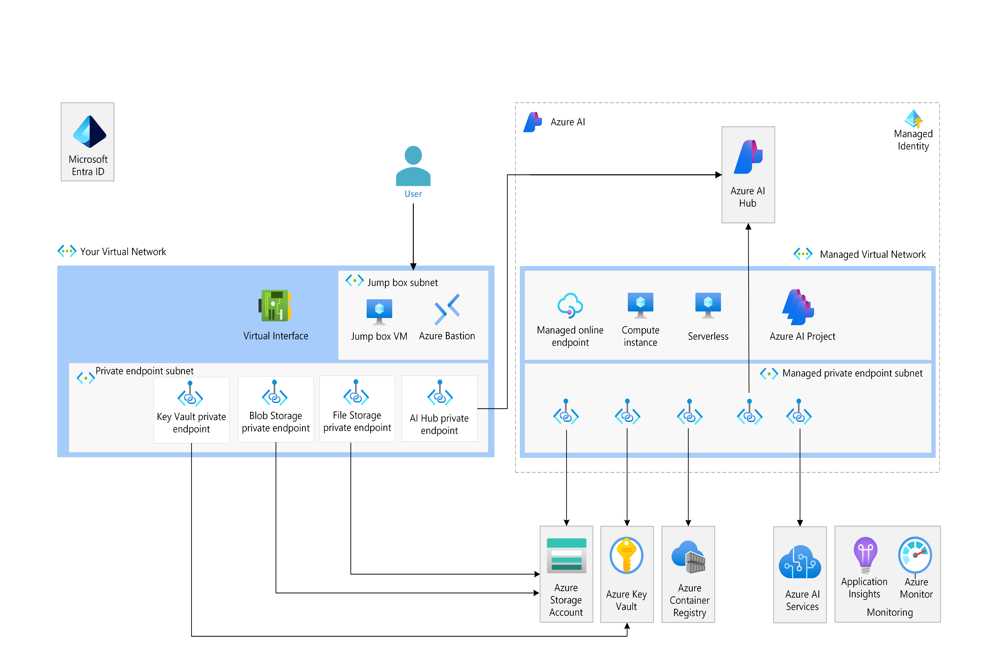

## AI Reference Implementation Baseline Pattern Module

### Overview

The AI Reference Implementation Baseline Pattern Module provides a secure, observable by default, scalable, and highly configurable foundation for deploying AI workloads on Azure. This pattern module integrates multiple Azure resources, following best practices and architectural standards, to deliver a comprehensive AI Reference Implementation. The goal is to accelerate the deployment of AI solutions by providing a ready-to-use infrastructure that adheres to Azure's Well-Architected Framework.

This pattern module is opinionated, meaning it comes with pre-configured defaults for security, observability, and essential AI resources. However, it remains flexible, allowing users to customize the environment to meet specific project needs by enabling or disabling various components.

### Architecture

The pattern module is designed to be modular and composable. The default deployment includes a minimum set of resources required to establish a secure and observable AI environment, but additional resources can be added based on project requirements. Below is a high-level architecture diagram:



### Key Features and Goals

This AI Reference Implementation pattern module is designed to accelerate the deployment of AI solutions on Azure, while ensuring security, compliance, flexibility, and observability. The primary objectives and functionalities of this module include:

1. **Security by Default:** Ensuring that all deployed resources adhere to Azure's security best practices, including network isolation, encryption, and identity management. This guarantees that AI environments are secure from the outset. For more details, see [Security practices](./security_practices.md).
    
2. **Observability:** Providing out-of-the-box integration of logging, monitoring, and alerting, making the AI environment fully observable from day one. This ensures that all deployments are transparent and issues can be quickly identified and resolved. More details are available in [Observability practices](./observability_practices.md).
    
3. **Modular and Flexible Design:** Composed of several modules that can be individually enabled or disabled, this pattern offers a flexible architecture that can be tailored to specific project needs. This modular approach allows teams to start with a minimal setup and expand as required, ensuring the AI environment is scalable and adaptable.
    
4. **Compliance with Azure Best Practices:** Adhering to the recommendations of the Azure Well-Architected Framework, this module ensures that all resources and configurations are optimized for performance, reliability, security, and cost management.
    
5. **Rapid Deployment and Consistency:** By providing a standardized reference implementation, this module accelerates the deployment process and ensures consistency across different projects and teams. This reduces variability and guarantees that best practices are consistently applied in all AI environments.

### Usage

This pattern module is designed for both data scientists and engineers who need to quickly stand up a secure, scalable AI environment on Azure. It is also suitable for organizations that require a compliant and secure environment for their AI workloads with the flexibility to customize the setup based on project-specific needs.

#### Example Usage

To deploy the AI Reference Implementation Baseline with minimal configuration:

```hcl
module "ai_reference_implementation" {
  source  = "Azure/avm-ptn-ai-reference-implementation/azurerm"
  version = "x.x.x"

  resource_group_name = "<your_resource_group>"
  location            = "<your_location>"
  jumpbox = {
    create = true
  }
}
```

This example sets up the AI Reference Implementation with all default resources and a jumpbox so you can access your workspace from the virtual network. The username is `azureuser` and the password is generated and can be found in the tfstate file but you may need to reset from the portal. The following default configuration is used for the jumpbox VM creation if enabled and can be updated for your needs.

If you need an easy way to get a list of available VM sizes in a specific region and availability zone:

```sh
# The following is a simple command will list Standard_D VM sizes and have no restrictions in southcentralus region
az vm list-skus -l southcentralus --size Standard_D -o table | grep None
```

```
{
  os_type = "Windows"
  size = "Standard_D4s_v3"
  zone = "1"
  accelerated_networking_enabled = false
  image_ref = {
    publisher = "microsoftwindowsdesktop"
    offer     = "windows-11"
    sku       = "win11-22h2-ent"
    version   = "latest"
  }
}    
```

### Use Cases

This module is ideal for:

* **Data Scientists:** Who need a secure, scalable, and integrated environment to experiment, develop, and train machine learning models.
* **ML Engineers:** Looking to deploy machine learning models into production with robust monitoring, scaling, and management capabilities.
* **Organizations:** That require a compliant and secure environment for their machine learning workloads, with the flexibility to integrate with existing Azure services.

### Extending the Pattern Module

The AI Reference Implementation Baseline Pattern Module is designed to be extended. You can add additional resources or services by integrating other Azure Verified Modules (AVM). For example, you can include additional machine learning environments, data lakes, or advanced AI services by simply integrating their respective modules and configuring them within the pattern module.

### Additional Resources

* **Azure Well-Architected Framework:** [Azure WAF](https://learn.microsoft.com/en-us/azure/architecture/framework/)
* **Azure AI Documentation:** [Azure AI Services](https://learn.microsoft.com/en-us/azure/ai-services/)
* **Terraform Registry:** Terraform AzureRM Provider

### Contributing

This module is part of the Azure Verified Modules (AVM) ecosystem, and contributions are welcome. Please follow the standard contribution guidelines if you wish to submit enhancements or report issues.
