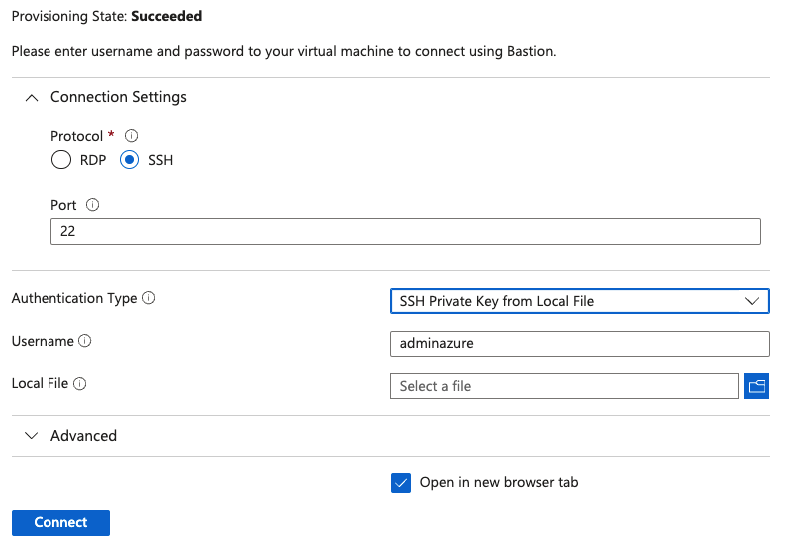

# OpenVPN Connection Example

This example demonstrates how to set up an OpenVPN connection to access resources within a virtual network. The provided setup uses a simplified configuration with a single Ubuntu VM deployed on the same network as the virtual machines you intend to work with.

**Benefits:**
- **Concurrent Access:** Multiple users can access the workspace simultaneously without needing separate VMs.
- **Local Tool Integration:** Use tools on your local machine to interact with the environment, eliminating the need for additional setup.

**Note:** Ideally, users should integrate this setup with their existing VPN solutions to avoid deploying another VPN instance.

## Requirements

To use this example, ensure you have:

- A folder `~/.ssh` containing your private key for VPN access.
- A file `~/.ssh/id_rsa.pub` with your public key for VPN access.
- Access to the internet or a local copy of an OpenVPN provisioning script.
- An OpenVPN client installed on your machine.

## How to Use

Follow these steps to set up and connect to the VPN:

1. **Initialize Terraform:**
   ```bash
   terraform init
   ```
   Run this command in the folder containing the example files.

2. **Apply Terraform Configuration:**
   ```bash
   terraform apply
   ```
   Run this command in the same folder.

3. **Note the VPN Box IP:**
   Record the public IP address of the VPN VM, named `example-vpn-vm`.

4. **Connect to the VPN Box:**
   In the portal, locate the VPN VM `example-vpn-vm` and use Bastion to connect to it.
   

5. **Install OpenVPN Server:**
   Install the OpenVPN server, ensuring you keep the default port 1194 as configured in the module. Use the following script from [Nyr's OpenVPN install script](https://github.com/Nyr/openvpn-install):
   ```bash
   sudo su
   wget https://git.io/vpn -O openvpn-install.sh && bash openvpn-install.sh
   ```
   Follow the on-screen instructions.
   

6. **Connect to the VPN:**
   After installation, you will receive a `<yourname>.ovpn` file. Import this file into your OpenVPN client and connect to the VPN.

7. **Access the Workspace:**
   Navigate to your Azure Machine Learning workspace in the portal and click on "Launch Studio." You should now have access without any issues.
